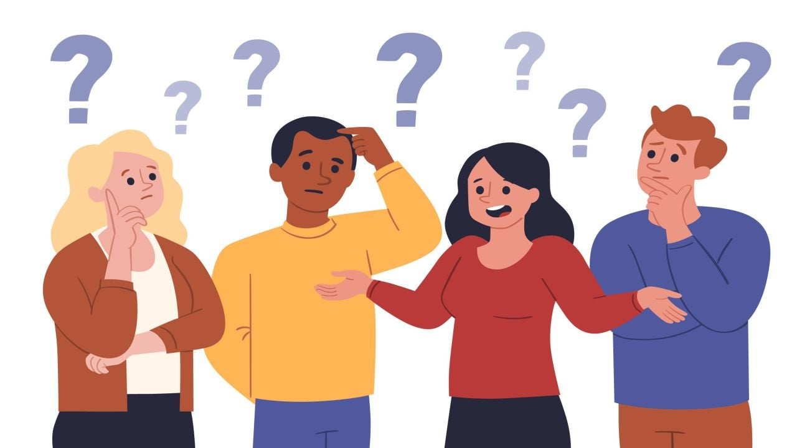

# Conceptos básicos
### Todo cuanto necesitas para jugar

Mucha gente, yo incluido, cuando empieza a jugar suele preguntarse cosas como *"pero, ¿qué necesito saber para jugar?"* *"¿Cuántos dados necesito para una sesión?"* *"¿Me tengo que comprar las figuras?"*

Y la respuesta a todas ellas es simple: **depende**. Es decir, obviamente todos queremos jugar a D&D a modo profesional como hemos visto en los vídeos virales de **Critical Role** pero ¿es realmente necesario? La respuesta corta es **no**. 

Para jugar a D&D solo necesitamos 4 cosas: **un personaje**, un **grupo de 2-5 amigos**, un **Dungeon Master** y, sobre todo **mucha imaginación**.

El resto son añadidos que nos facilitan la inmersión en la partida y hacen que jugar sea más divertido, pero no por ello implica que sea inprescindible.

Hay muchas formas de jugar a D&D, se puede jugar en mesa o por internet. Con las fichas en físico o en digital y con dados reales o aplicaciones que hagan las tiradas, el caso es que encuentres con la que te sientas mejor y puedas jugar a gusto.

### Conceptos básicos

Hablaremos de todos estos conceptos más adelante en profundidad pero para empezar deberían sonarte cosas como:

* `Raza/Subraza:` Nos indica la naturaleza del personaje, determina qué rasgos va a obtener así como en qué habilidades destacará. Humanos, elfos y enanos son algunas de las razas que hay.
* `Clase/Subclase:` Se trata del rol que desempeña tu personaje en el mundo y determina qué acciones va a poder ejercer en combate o en qué habilidades va a destacar también. Hechicero, druida y paladín serían algunos ejemplos.
* `Trasfondo:` Es el pasado de tu personaje, qué ha hecho y cómo ha vivido hasta llegar al día de hoy. Por supuesto también va a otorgarnos habilidades y rasgos. Erudito, huérfano o héroe del pueblo son ejemplos de trasfondo.
* `Características:` Son las estadísticas de nuestro personaje. Determinan la fuerza, destreza, inteligencia, sabiduría, carisma y constitución de nuestro personaje.
* `Habilidades:` Son las capacidades tanto físicas como mentales de nuestro personaje. Se basan en 
* `Rasgos:` 
* `Tiradas:` 