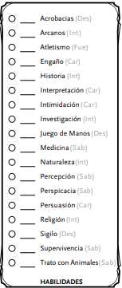

# **Habilidades y carcterísticas**
## Capacidades y habilidades físicas

Hemos hablado sobre las *habilidades* que ganan los personajes por ser de una raza o una clase concreta. Dichas habilidades tales como el **aliento de dragón** del dracónido son conocidas como **Rasgos**. 

Lo que se conoce como **Habilidades** es más bien todas aquellas capacidades tanto físicas como mentales que tiene nuestro personaje. 

Es decir, las **Habilidades** vienen definidas por el pasado y la personalidad del personaje como podría ser *trato con animales* en caso de que nuestro personaje tenga una conexión especial con las criaturas salvajes o *persuasión* si nuestro personaje es muy carismático o tiene una gran capacidad de persuasión gracias a haber adquirido un amplio vocabulario debido a su educación. Vamos a verlo con algún ejemplo.

### Competencias obtenidas al vivir

Tenemos bastantes habilidades en las que poder definir y diferenciar a nuestro personaje de cualquier otro. 

  

Por ejemplo:

- `Historia` : Define a un personaje estudioso que conoce cualquier relato, historia o acontecimiento pasado. También puede servir para alguien milenario que haya vivido dichos acontecimientos.

- `Percepción` : Sirve para indicar que nuestro personaje está muy atento a su alrededor, permaneciendo alerta casi de forma innata. Por otra parte, un personaje con poca percepción sería indicativo de que el personaje es más bien despreocupado y le cuesta estar atento a los detalles.

- `Juego de manos` : Es típico en aquellos personajes con más destreza, sirve tanto para *pícaros* que quieran robarte alguna gema del bolsillo como para alguien que intente hacer malabares para distraer al enemigo.

Como podéis ver en los ejemplos las posibilidades son muy amplias a la hora de darle personalidad y distinguir a nuestro personaje y hay que tratar de ser coherentes con lo que estemos construyendo. 

Yo por ejemplo, en el caso del clérigo que hemos creado en el apartado de **Clases**, algo que tendría sentido es que tuviera una alta puntuación en *Religión*, *Historia* y *Arcano*. Lo que define a un personaje que ha optado por el estudio de los dioses, la historia y la magia divina.