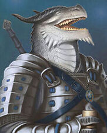

# **Razas**  
## De los humanos a los gnomos

En D&D puedes encarnar al personaje que quieras, desde un humano común hasta una criatura humanoide proveniente del underdark, el límite está en tu imaginación (y en lo que te permita el **DM**) aquí **no veremos todas las razas**, sino que **explicaré cómo funcionan en general** para crear un personaje, y sabiendo esto ya podréis escoger la que queráis.

Lo principal al crear un personaje, desde mi punto de vista, es pensar en qué te apetece jugar, qué ser de fantasía medieval quieres encarnar en tu aventura. 

Cada raza tiene ciertas ventajas e inconvenientes, habilidades y atributos que combinan mejor con según qué clase elijas, todo depende de qué es lo que te guste a ti, por ejemplo:  
  
Los dracónidos son una raza orgullosa y valiente que desciende de los dragones primigenios. Seres a quienes se les otorga el hecho de haber creado la magia con su habla y de quienes han emergido deidades como **Bahamut** o **Tiamat**.

Es esta descendencia de los antiguos dragones la que les proporciona sus cualidades físicas. Suelen ser altos comparados con los humanos y corpulentos por lo general. Tienen el cuerpo cubierto de escamas de color el cual viene determinado por su linaje (ver tabla en el **manual del jugador**) y le otorgará un rasgo único de esta clase: ***Ataque de aliento***.  

Es por esto que, por el simple hecho de escoger esta raza, vas a obtener:  

* **+2 en Fuerza**
* **+1 en Carisma** 
* **Resistencia al daño** del tipo que determine tu linaje dracónido.
* **Ataque de aliento** (varía según el linaje dracónido)  

Siendo así una raza con cierta ventaja a la hora de usar la clase **paladín** ya que parten con unos bonificadores de base que otras razas como los enanos no tienen y que son muy importantes para las mecánicas de la misma.

Hay muchísimas razas en D&D y cada una de ellas tiene unas habilidades y bonificaciones diferentes. Humanos, medianos, elfos, semielfos, gnomos...  
La cosa es que elijas la que más te guste o más te apetezca rolear.

Aquí te enseño dos páginas donde podrás ver más información sobre las razas clases y demás:

La primera página que os muestro es [Nivel 20](https://nivel20.com/games/dnd-5/races) que hace un gran trabajo recopilando la información y poniéndola a disposición de todos. En ella podréis encontrar toda la información necesaria para crear cualquier personaje con las *razas del juego base*.

También podéis visitar el **sitio oficial de Dungeons and Dragons: [D&D Beyond](https://www.dndbeyond.com/)** donde encontraréis absolutamente todo lo relacionado con el mundo de Dungeons and Dragons. **Todas las razas disponibles** y qué es lo que obtiene cada una, detalles de cómo se crían y cuál es el pasado de la misma e incluso la posibilidad de comprar los libros y campañas.
